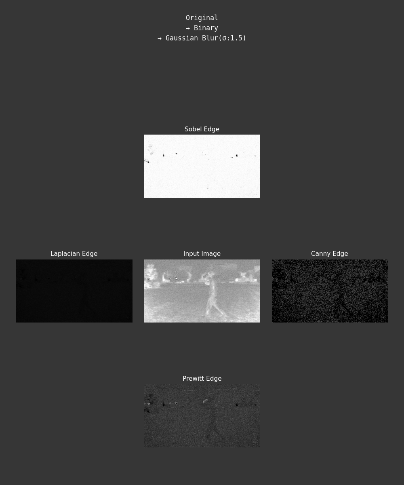
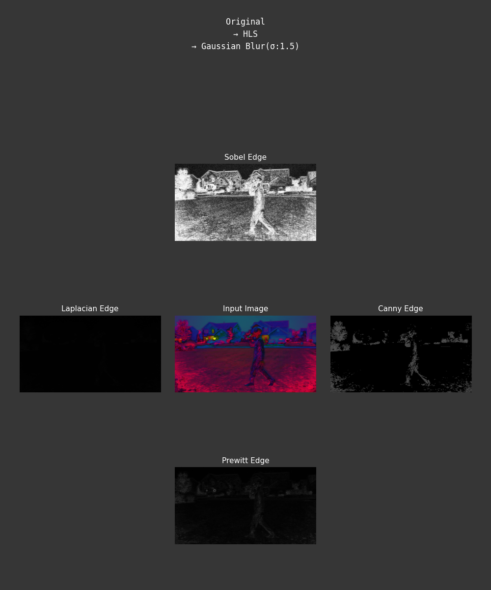
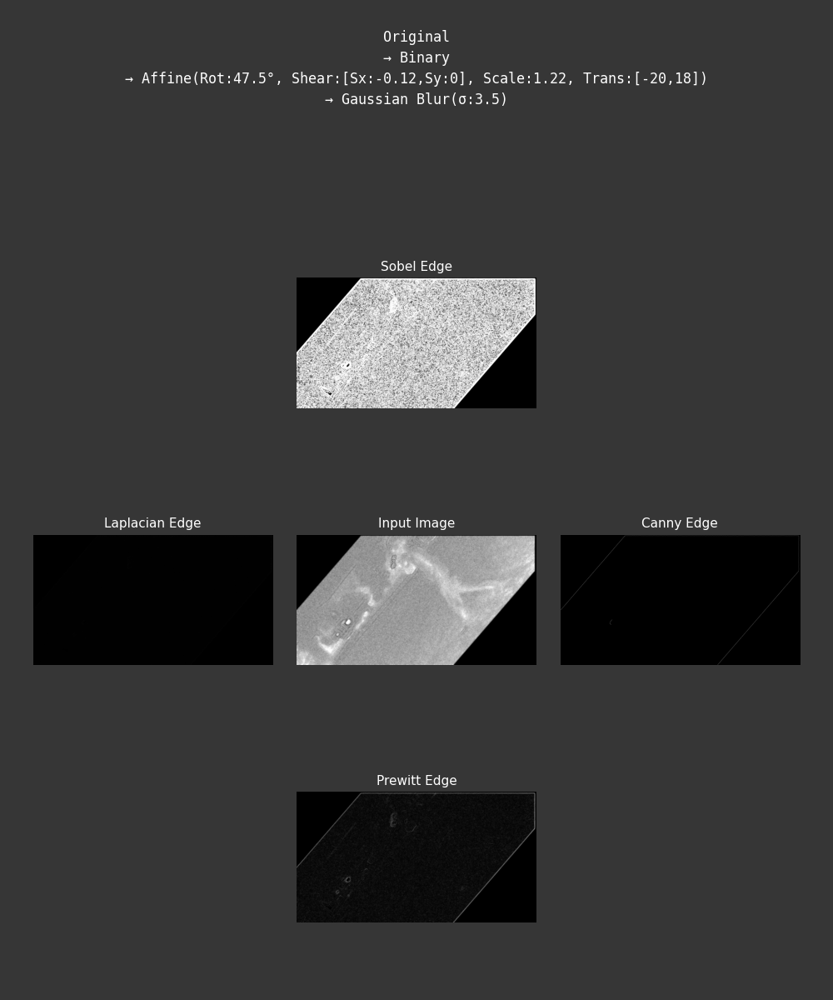
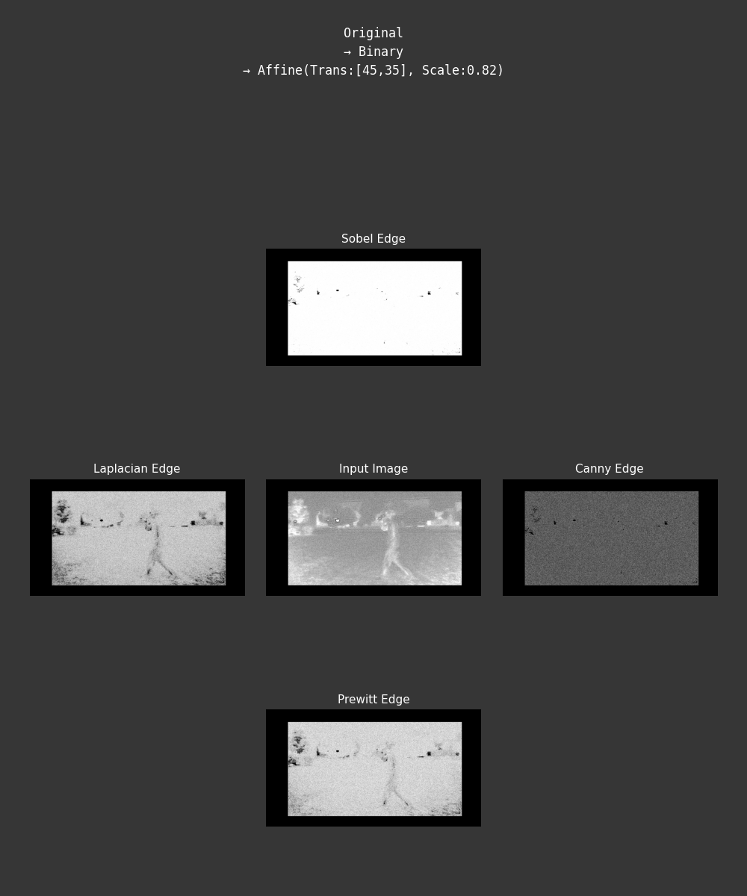
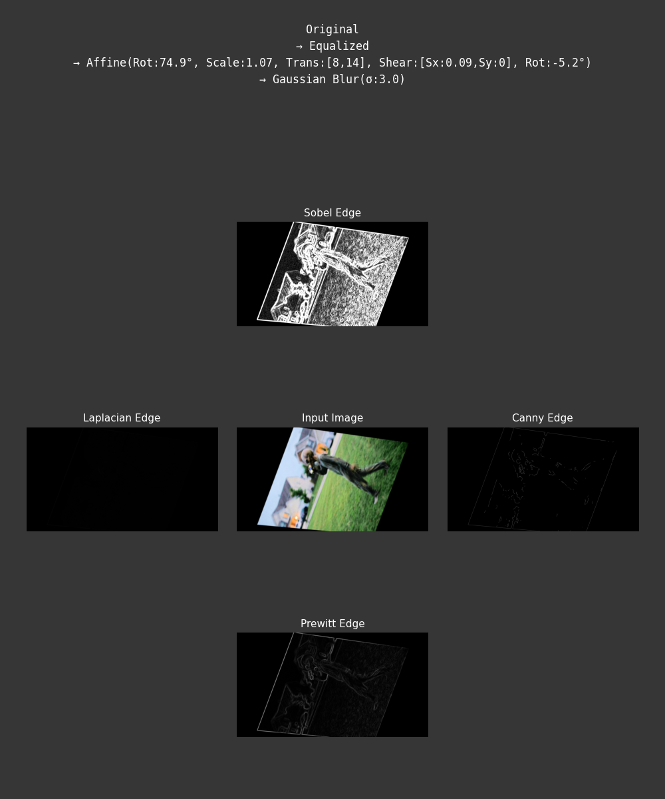
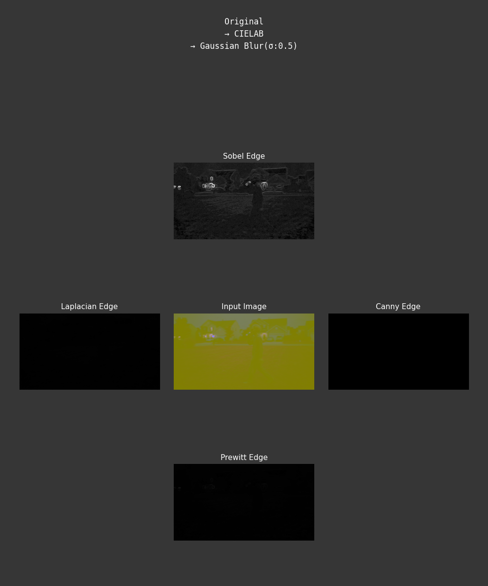

# System requirement
- Python 3.11

# Setting up environment
- Install Python libraries
```bash
pip install -r requirements.txt
```
- [Download](https://github.com/codyfarlow1/CS898BA-HWOne) Homework Image and Make sure the name is <b>"HW1_IMG_CS898BA.png"</b>

# Run code
- Execute the Python script
```bash
python -u KhangDuong_HW1.py
```

# Output Examples












