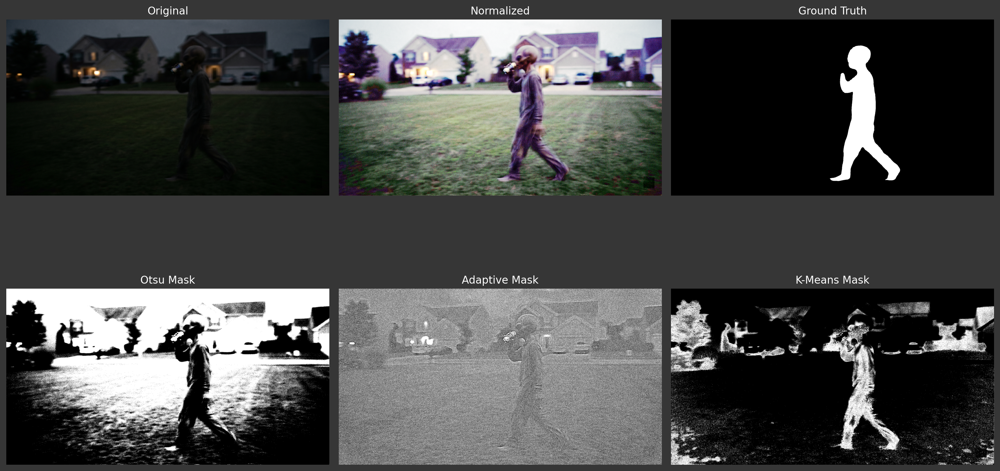

# System requirement
- Python 3.11

---

# Code Explanations

All work lives in [KhangDuong_HW1.py](KhangDuong_HW1.py) and [KhangDuong_HW2.py](KhangDuong_HW2.py). The script is organized to mirror the homework parts from [CS898BA-HWOne](https://github.com/codyfarlow1/CS898BA-HWOne) and [CS898BA-HWTwo](https://github.com/codyfarlow1/CS898BA-HW2).

## HW1 Explanations
### Libraries and Seed
The script uses `os` and `re` for filesystem and filename parsing, `random` plus NumPy's `np.random.default_rng` for sampling, `cv2` (OpenCV) for all image processing, and `matplotlib.pyplot` with `GridSpec` for the 3×3 output plot layout.
`SEED = 42` is defined for reproducible purpose.

### Clean directory
Before generating anything, the script scans the working directory and deletes every file matching `HW1_IMG_CS898BA*.png` **except** the original `HW1_IMG_CS898BA.png`. This guarantees each run starts from a clean slate so leftover images from a previous run can't pollute the count or next parts.

### Part 2.1 — Channel statistics
The image is split into B, G, R channels with `cv2.split` and the following stats are printed per channel: `min`, `max`, `mean`, `median` (`np.median`), `mode` (most frequent value using `np.bincount`), non-parametric `skew` = (mean − median) / std, `range`, `std`, and `variance`.

### Part 2.2 — Color space conversions
- **Grayscale:** `cv2.cvtColor(..., COLOR_BGR2GRAY)`.
- **Binary:** `cv2.adaptiveThreshold` with `ADAPTIVE_THRESH_GAUSSIAN_C`, `blockSize=11`, `C=2` — adaptive thresholding handles uneven lighting better than a global threshold. Values are suggested by Google AI Mode.
- **HSV / CIELAB / HLS:** direct `cv2.cvtColor` calls similar to **Grayscale**.

### Part 2.3 / 2.4 — Histogram equalization on V
The HSV image is split to `hue`, `saturation`, and `value` channels only the value (V) channel is passed to `cv2.equalizeHist`, then channels are merged back and converted to BGR with `cv2.cvtColor(..., COLOR_HSV2BGR)`.
This normalizes brightness without distorting hue or saturation.

### Part 2.6 — Random affine transformations
`transformations_dict` maps each color-space variant to **two unique sequences** of affine ops (rotate / scale / translate / shear).

Each sequence has **2–5 transforms**, with at least two of the four types per image, and all values are unique across the dict so no two output images are transformed identically. 

Helper functions for this task are:
- `rotate_image` — `cv2.getRotationMatrix2D` around the image center, then `cv2.warpAffine`.
- `shear_image` — three-point `cv2.getAffineTransform`. Input `shear_matrix` is normalized `[[0,0],[1,0],[0,1]]` so it can be multiplied element-wise by `[width, height]` via NumPy broadcasting.
- `scale_image` — affine matrix scaling around the center; output size is kept equal to input so scaled-up content gets cropped and scaled-down content gets zero-padded (preserves original dimensions).
- `translate_image` — simple translation matrix.

Transform all images in the directory based on the dictionary.

### Part 2.8 — Gaussian blur
Each image is blurred at σ in [0.5, 1.0, 1.5, 2.0, 2.5, 3.0, 3.5] using `cv2.GaussianBlur(..., (0, 0), sigmaX=σ, sigmaY=σ)` — passing `(0, 0)` lets OpenCV compute the kernel size from σ. Discussion of the effect is in [Discussions](#effect-of-gaussian-blur-σ-part-28).

### Part 3.1–3.3 — Subset selection
The 168 generated images are shuffled with a seeded `np.random.default_rng` (seed=42 for reproducibility), partitioned into 4 equal subsets of 42 images, and subset 0 is chosen for edge detection. Non-chosen images are deleted so the working directory only holds the 42 subset images plus the original.

### Part 3.4-3.7 — Edge detection
For every image in the chosen subset, apply the edge detection algorithms below and save image:
- **Sobel:** `cv2.Sobel` at `ksize=5` for both axes, then `cv2.magnitude` and `cv2.convertScaleAbs`. The wider kernel adds Gaussian-style smoothing so it survives blur well.
- **Laplacian:** `cv2.Laplacian` with `CV_64F` (signed) then absolute-scaled to `uint8`.
- **Canny:** auto-thresholds via the median heuristic `lower = (1 − σ) · median`, `upper = (1 + σ) · median` with σ = 0.33. This adapts per-image instead of using fixed cutoffs, like 50/150, which more frequently produced empty edge maps on some images and over-saturated maps on others.
- **Prewitt:** two custom 3×3 kernels via `cv2.filter2D`, magnitude via `np.sqrt(px² + py²)`, then absolute-scaled.

Discussion of the Pros and Cons for the Edge detection algorithms is in [Discussions](#edge-detection--pros-cons-and-which-wins-for-this-set-part-35).

### Part 3.8 — 5-image plots
For each of the 42 subset images, a matplotlib figure is built with:
- A dark gray background and white text.
- A multi-line title above each plot describes the processing chain (original → color space → affine → blur σ).
- A 3×3 `GridSpec`: Sobel top-center (0, 1), Laplacian/Input/Canny on the middle row (1, 0-2), Prewitt bottom-center (2, 1).

All 42 plots are saved to `plots/`, then 6 are randomly sampled (seeded with 42) and injected into this README between the `# Output Examples` and the next `---` separator.

## HW2 Explanations
### Libraries and Seed
The HW2 script uses `os` for the directory cleanup, `cv2` (OpenCV) for all image processing, and `numpy` for array math and the K-Means input/output reshaping.
`SEED = 42` is fed into `cv2.setRNGSeed(SEED)` so the internal RNG that `cv2.kmeans` relies on for centroid initialization is reproducible across runs.

### Clean directory
Same as HW1: everything matching `HW1_IMG_CS898BA*.png` is deleted **except** the original `HW1_IMG_CS898BA.png` so each run starts clean.

### Part 2 — Multi-Channel Color Normalization
The original BGR image is split into its three channels with `cv2.split`. Each channel is passed independently through `cv2.equalizeHist`, which stretches that channel's histogram so dark pixels become darker and bright pixels become brighter. The three equalized channels are merged back with `cv2.merge` to produce the normalized color image that drives every subsequent segmentation step.

### Part 3 — Threshold-Based Segmentation
The normalized image is converted to grayscale with `cv2.cvtColor(..., COLOR_BGR2GRAY)`, then:
- **Otsu's global thresholding:** `cv2.threshold(..., 0, 255, THRESH_BINARY + THRESH_OTSU)` picks a single optimal cutoff from the bimodal intensity histogram.
- **Adaptive Gaussian thresholding:** `cv2.adaptiveThreshold(..., ADAPTIVE_THRESH_GAUSSIAN_C, THRESH_BINARY, blockSize=11, C=2)` thresholds each pixel against a Gaussian-weighted local window so uneven lighting is handled locally.

For each method the binary mask is saved, and a foreground extraction is built with `cv2.bitwise_and(normalized_image, normalized_image, mask=...)` and saved as well.

### Part 4 — K-Means Clustering Segmentation
The normalized image is converted to HSV (`COLOR_BGR2HSV`) and reshaped into an `(H*W, 3)` float32 array of pixel triples. `cv2.kmeans` is called for `K = 3, 4, 5` with `KMEANS_RANDOM_CENTERS` and `attempts=10`. After each call the cluster indices are reordered by ascending centroid V (brightness) so cluster 0 is always the darkest and cluster K-1 is always the brightest — this makes the cluster index stable across runs and meaningful to the user.

For every K the script saves:
- a `quantized.png` preview of the whole image colored by its cluster centroid (for comparing Ks at a glance),
- a binary 0/255 mask per cluster (so the figure-bearing cluster can be identified visually),
- the corresponding foreground extraction per cluster.

Finally, after visually analyze the masks, two constants `OPTIMAL_K` and `FIGURE_CLUSTER` drive a single re-run of K-Means at the chosen `K=5` and `FIGURE_CLUSTER=1`, and the final `HW1_IMG_CS898BA_kmeans_mask.png` (figure = 255, everything else = 0) and `HW1_IMG_CS898BA_kmeans_foreground.png` are written using the same naming convention as Otsu and Adaptive.

### Part 5 — Evaluation
For the HW1 vs HW2 comparison the script re-creates the HW1 adaptive binary by running `cv2.adaptiveThreshold` directly on the **raw** grayscale image (not the equalized one) with identical parameters, and saves it as `HW1_IMG_CS898BA_binary.png`. This isolates per-channel histogram equalization as the only variable between the two adaptive outputs. The qualitative discussion of the three HW2 methods and the HW1 vs HW2 comparison is in [Discussions](#segmentation-methods--pros-cons-and-which-wins-for-this-image-hw2-part-5).

# Setting up environment
- Install Python libraries
```bash
pip install -r requirements.txt
```
- [Download](https://github.com/codyfarlow1/CS898BA-HWOne) Homework Image and Make sure the name is <b>"HW1_IMG_CS898BA.png"</b>

# Run code
- Execute the Python script
```bash
python -u KhangDuong_HW1.py
```
or
```bash
python -u KhangDuong_HW2.py
```

---

# HW 1 Output Examples


---

## HW 2 Segmentation Comparison



---

# Discussions

### Effect of Gaussian blur σ (Part 2.8)
Low sigma values like 0.5 and 1.0 helps in smoothing the images while preserving most of the details.
As the sigma value increases, the images lose more and more details like edges and textures, which makes it harder to detect edges later on.

### Edge detection — pros, cons, and which wins for this set (Part 3.5)

**Sobel**
- *Pros:* Details edges in both horizontal and vertical directions.
- *Cons:* May produce thick and/or non-connected edges, sensitive to noise.

**Laplacian**
- *Pros:* Detects edges in all directions, good for finding fine details.
- *Cons:* Very sensitive to noise, may produce false edges.

**Canny**
- *Pros:* Good for detecting edges in noisy images, provides thin and connected edges, uses non-maximum suppression.
- *Cons:* Requires tuning of threshold cutoffs, may miss weak edges or produce false edges.

**Prewitt**
- *Pros:* Simple and fast, good for detecting edges in clean images.
- *Cons:* May produce thicker edges, sensitive to noise.

For this image set, Sobel is the best because it provides clear edges out of the most images, while Laplacian and Prewitt produce more noise and Canny misses some edges in the blurred images. However, for bright images, Prewitt can perform better than Sobel because Sobel produce too many edges.

### Segmentation methods — pros, cons, and which wins for this image (HW2 Part 5)

None of the three methods captures the figure as a single connected region — it is split into disconnected segments in every output and all three masks pull in background pixels.

**Otsu's global thresholding**
- *Pros:* Smoothest mask of the three with the least high-frequency noise, so the large shapes of the figure stay readable.
- *Cons:* Global cutoff classifies the houses, porch, and sky as white too, and the figure fragments wherever its brightness crosses the threshold.

**Adaptive Gaussian thresholding**
- *Pros:* Sensitive to local intensity changes, so it traces the figure's silhouette and tolerates uneven lighting.
- *Cons:* Output is almost pure salt-and-pepper — leaves, porch boards, shingles, and brick mortar all become speckle, burying the figure in noise.

**K-Means in HSV (K = `OPTIMAL_K`)**
- *Pros:* Clustering in HSV groups pixels by color, so the figure is the dominant content of the chosen cluster — relatively the best of the three.
- *Cons:* Background houses, trees, and foliage with a similar color cast still land in the figure cluster, the figure is still fragmented, and edges are blocky.

**Best for this image: K-Means, but only relatively.** It is the only one where the figure is the dominant content of the mask, but it is not a clean segmentation — background houses still leak in and the figure itself is fragmented. Otsu is the runner-up on cleanliness but treats too much of the bright background as foreground. Adaptive is unusable as a standalone segmentation without heavy morphological cleanup.

### Effect of per-channel histogram equalization (HW1 vs HW2)
HW1's adaptive binary used the raw grayscale; HW2's adaptive uses the equalized grayscale. Per-channel histogram equalization redistributes intensities so dark, low-variation regions get stretched into a usable range, which gives the local Gaussian window more consistent statistics. HW2's adaptive mask therefore looks cleaner than HW1's: fewer arbitrary speckles in shadowed background and a more coherent silhouette around the figure. The same stretch sharpens the global intensity histogram, which makes Otsu's automatic cutoff land on a meaningful valley instead of collapsing the image into a near-uniform mask, and it helps K-Means by widening color separation between the figure and the background.
