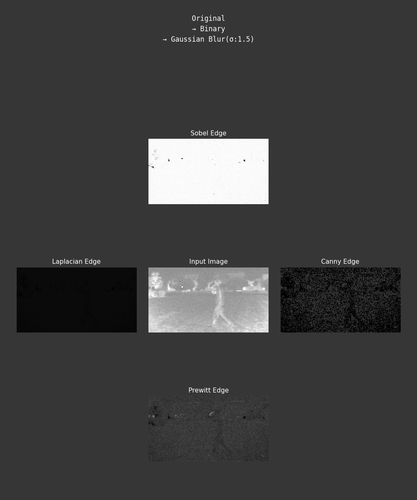
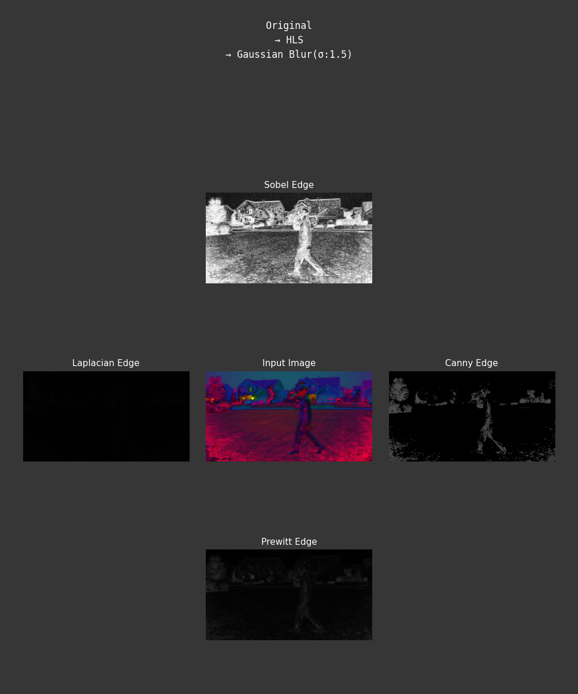
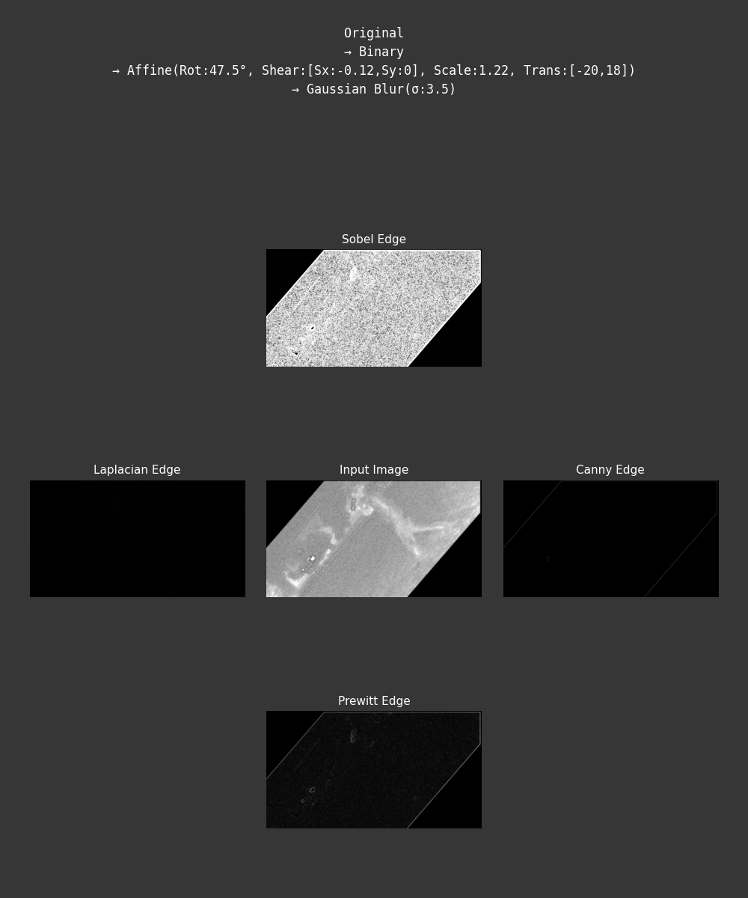
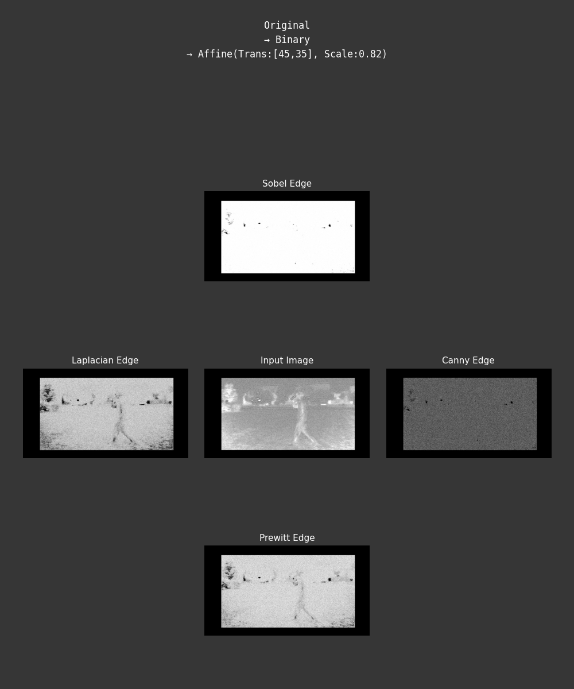
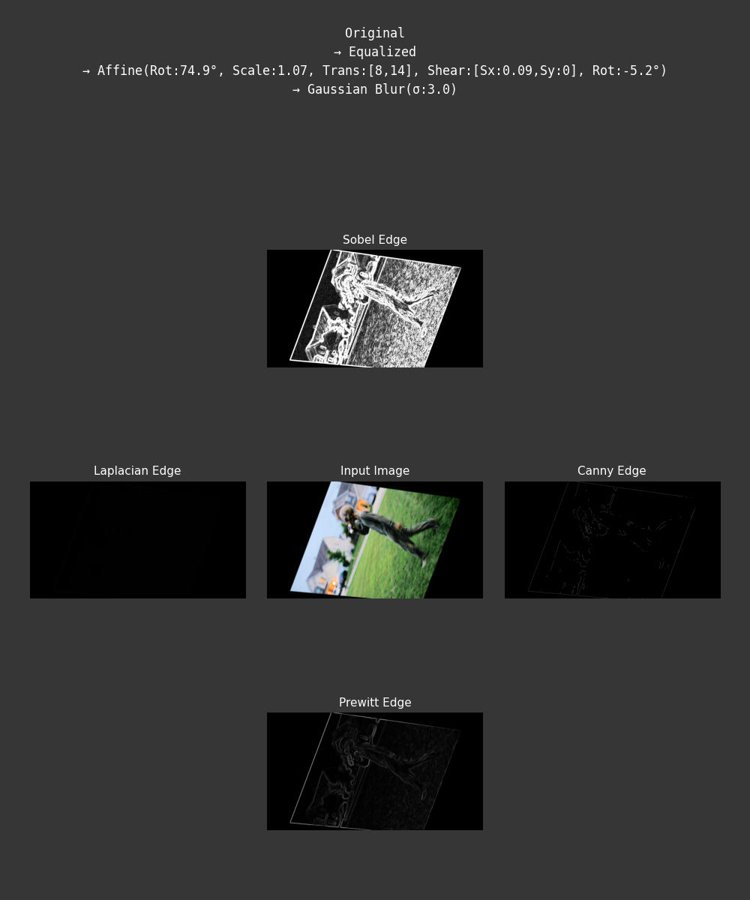
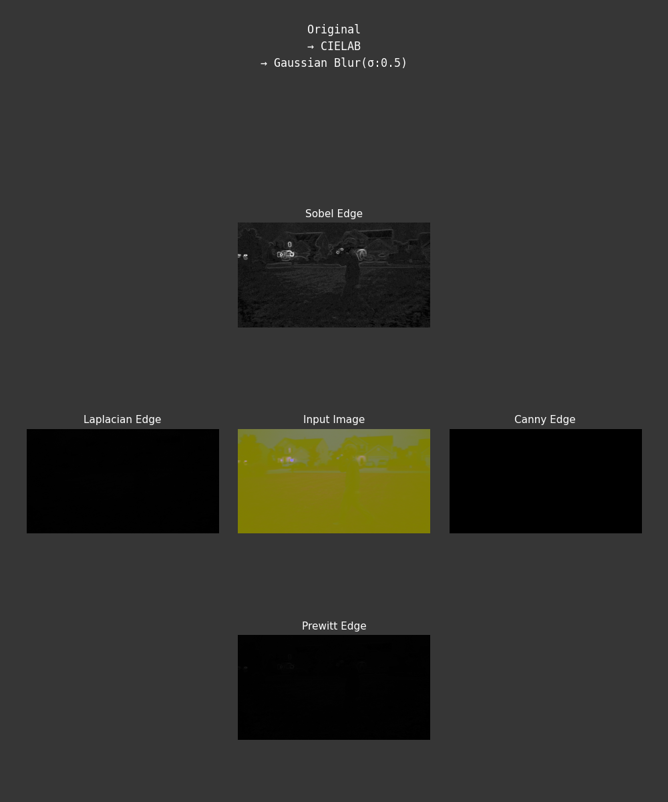
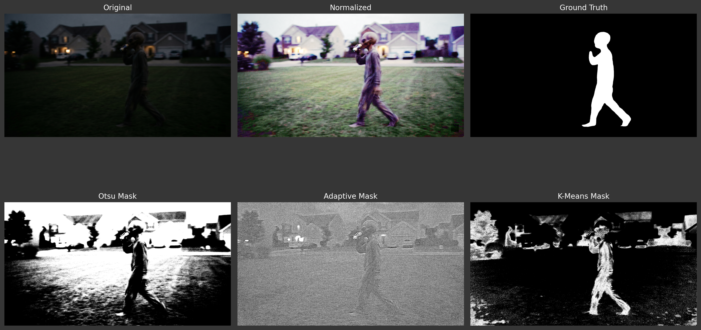
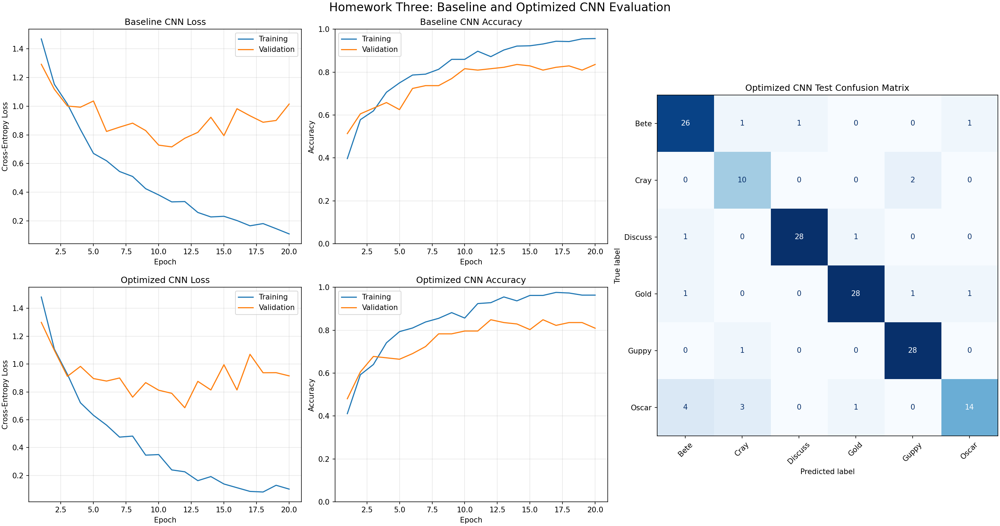
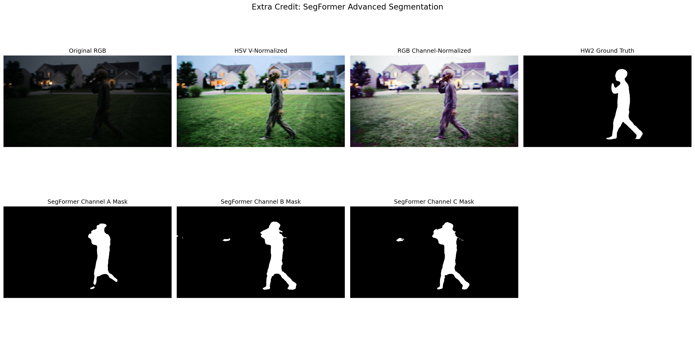

# System requirement
- Python 3.11

---

# Code Explanations

All work lives in [KhangDuong_HW1.py](KhangDuong_HW1.py) and [KhangDuong_HW2.py](KhangDuong_HW2.py). The script is organized to mirror the homework parts from [CS898BA-HWOne](https://github.com/codyfarlow1/CS898BA-HWOne) and [CS898BA-HWTwo](https://github.com/codyfarlow1/CS898BA-HW2).

## HW1 Explanations
### Libraries and Seed
The script uses `os` and `re` for filesystem and filename parsing, `random` plus NumPy's `np.random.default_rng` for sampling, `cv2` (OpenCV) for all image processing, and `matplotlib.pyplot` with `GridSpec` for the 3×3 output plot layout.
`SEED = 42` is defined for reproducible purpose.

### Clean directory
Before generating anything, the script scans the working directory and deletes every file matching `HW1_IMG_CS898BA*.png` **except** the original `HW1_IMG_CS898BA.png`. This guarantees each run starts from a clean slate so leftover images from a previous run can't pollute the count or next parts.

### Part 2.1 — Channel statistics
The image is split into B, G, R channels with `cv2.split` and the following stats are printed per channel: `min`, `max`, `mean`, `median` (`np.median`), `mode` (most frequent value using `np.bincount`), non-parametric `skew` = (mean − median) / std, `range`, `std`, and `variance`.

### Part 2.2 — Color space conversions
- **Grayscale:** `cv2.cvtColor(..., COLOR_BGR2GRAY)`.
- **Binary:** `cv2.adaptiveThreshold` with `ADAPTIVE_THRESH_GAUSSIAN_C`, `blockSize=11`, `C=2` — adaptive thresholding handles uneven lighting better than a global threshold. Values are suggested by Google AI Mode.
- **HSV / CIELAB / HLS:** direct `cv2.cvtColor` calls similar to **Grayscale**.

### Part 2.3 / 2.4 — Histogram equalization on V
The HSV image is split to `hue`, `saturation`, and `value` channels only the value (V) channel is passed to `cv2.equalizeHist`, then channels are merged back and converted to BGR with `cv2.cvtColor(..., COLOR_HSV2BGR)`.
This normalizes brightness without distorting hue or saturation.

### Part 2.6 — Random affine transformations
`transformations_dict` maps each color-space variant to **two unique sequences** of affine ops (rotate / scale / translate / shear).

Each sequence has **2–5 transforms**, with at least two of the four types per image, and all values are unique across the dict so no two output images are transformed identically. 

Helper functions for this task are:
- `rotate_image` — `cv2.getRotationMatrix2D` around the image center, then `cv2.warpAffine`.
- `shear_image` — three-point `cv2.getAffineTransform`. Input `shear_matrix` is normalized `[[0,0],[1,0],[0,1]]` so it can be multiplied element-wise by `[width, height]` via NumPy broadcasting.
- `scale_image` — affine matrix scaling around the center; output size is kept equal to input so scaled-up content gets cropped and scaled-down content gets zero-padded (preserves original dimensions).
- `translate_image` — simple translation matrix.

Transform all images in the directory based on the dictionary.

### Part 2.8 — Gaussian blur
Each image is blurred at σ in [0.5, 1.0, 1.5, 2.0, 2.5, 3.0, 3.5] using `cv2.GaussianBlur(..., (0, 0), sigmaX=σ, sigmaY=σ)` — passing `(0, 0)` lets OpenCV compute the kernel size from σ. Discussion of the effect is in [Discussions](#effect-of-gaussian-blur-σ-part-28).

### Part 3.1–3.3 — Subset selection
The 168 generated images are shuffled with a seeded `np.random.default_rng` (seed=42 for reproducibility), partitioned into 4 equal subsets of 42 images, and subset 0 is chosen for edge detection. Non-chosen images are deleted so the working directory only holds the 42 subset images plus the original.

### Part 3.4-3.7 — Edge detection
For every image in the chosen subset, apply the edge detection algorithms below and save image:
- **Sobel:** `cv2.Sobel` at `ksize=5` for both axes, then `cv2.magnitude` and `cv2.convertScaleAbs`. The wider kernel adds Gaussian-style smoothing so it survives blur well.
- **Laplacian:** `cv2.Laplacian` with `CV_64F` (signed) then absolute-scaled to `uint8`.
- **Canny:** auto-thresholds via the median heuristic `lower = (1 − σ) · median`, `upper = (1 + σ) · median` with σ = 0.33. This adapts per-image instead of using fixed cutoffs, like 50/150, which more frequently produced empty edge maps on some images and over-saturated maps on others.
- **Prewitt:** two custom 3×3 kernels via `cv2.filter2D`, magnitude via `np.sqrt(px² + py²)`, then absolute-scaled.

Discussion of the Pros and Cons for the Edge detection algorithms is in [Discussions](#edge-detection--pros-cons-and-which-wins-for-this-set-part-35).

### Part 3.8 — 5-image plots
For each of the 42 subset images, a matplotlib figure is built with:
- A dark gray background and white text.
- A multi-line title above each plot describes the processing chain (original → color space → affine → blur σ).
- A 3×3 `GridSpec`: Sobel top-center (0, 1), Laplacian/Input/Canny on the middle row (1, 0-2), Prewitt bottom-center (2, 1).

All 42 plots are saved to `plots/`, then 6 are randomly sampled (seeded with 42) and injected into this README between the `# Output Examples` and the next `---` separator.

## HW2 Explanations
### Libraries and Seed
The HW2 script uses `os` for the directory cleanup, `cv2` (OpenCV) for all image processing, and `numpy` for array math and the K-Means input/output reshaping.
`SEED = 42` is fed into `cv2.setRNGSeed(SEED)` so the internal RNG that `cv2.kmeans` relies on for centroid initialization is reproducible across runs.

### Clean directory
Same as HW1: everything matching `HW1_IMG_CS898BA*.png` is deleted **except** the original `HW1_IMG_CS898BA.png` so each run starts clean.

### Part 2 — Multi-Channel Color Normalization
The original BGR image is split into its three channels with `cv2.split`. Each channel is passed independently through `cv2.equalizeHist`, which stretches that channel's histogram so dark pixels become darker and bright pixels become brighter. The three equalized channels are merged back with `cv2.merge` to produce the normalized color image that drives every subsequent segmentation step.

### Part 3 — Threshold-Based Segmentation
The normalized image is converted to grayscale with `cv2.cvtColor(..., COLOR_BGR2GRAY)`, then:
- **Otsu's global thresholding:** `cv2.threshold(..., 0, 255, THRESH_BINARY + THRESH_OTSU)` picks a single optimal cutoff from the bimodal intensity histogram.
- **Adaptive Gaussian thresholding:** `cv2.adaptiveThreshold(..., ADAPTIVE_THRESH_GAUSSIAN_C, THRESH_BINARY, blockSize=11, C=2)` thresholds each pixel against a Gaussian-weighted local window so uneven lighting is handled locally.

For each method the binary mask is saved, and a foreground extraction is built with `cv2.bitwise_and(normalized_image, normalized_image, mask=...)` and saved as well.

### Part 4 — K-Means Clustering Segmentation
The normalized image is converted to HSV (`COLOR_BGR2HSV`) and reshaped into an `(H*W, 3)` float32 array of pixel triples. `cv2.kmeans` is called for `K = 3, 4, 5` with `KMEANS_RANDOM_CENTERS` and `attempts=10`. After each call the cluster indices are reordered by ascending centroid V (brightness) so cluster 0 is always the darkest and cluster K-1 is always the brightest — this makes the cluster index stable across runs and meaningful to the user.

For every K the script saves:
- a `quantized.png` preview of the whole image colored by its cluster centroid (for comparing Ks at a glance),
- a binary 0/255 mask per cluster (so the figure-bearing cluster can be identified visually),
- the corresponding foreground extraction per cluster.

Finally, after visually analyze the masks, two constants `OPTIMAL_K` and `FIGURE_CLUSTER` drive a single re-run of K-Means at the chosen `K=5` and `FIGURE_CLUSTER=1`, and the final `HW1_IMG_CS898BA_kmeans_mask.png` (figure = 255, everything else = 0) and `HW1_IMG_CS898BA_kmeans_foreground.png` are written using the same naming convention as Otsu and Adaptive.

### Part 5 — Evaluation
For the HW1 vs HW2 comparison the script re-creates the HW1 adaptive binary by running `cv2.adaptiveThreshold` directly on the **raw** grayscale image (not the equalized one) with identical parameters, and saves it as `HW1_IMG_CS898BA_binary.png`. This isolates per-channel histogram equalization as the only variable between the two adaptive outputs. The qualitative discussion of the three HW2 methods and the HW1 vs HW2 comparison is in [Discussions](#segmentation-methods--pros-cons-and-which-wins-for-this-image-hw2-part-5).

# Setting up environment
- Install Python libraries
```bash
pip install -r requirements.txt
```
- [Download](https://github.com/codyfarlow1/CS898BA-HWOne) Homework Image and Make sure the name is <b>"HW1_IMG_CS898BA.png"</b>

# Run code
- Execute the Python script
```bash
python -u KhangDuong_HW1.py
```
or
```bash
python -u KhangDuong_HW2.py
```

---

# Homework Output Examples

## HW 1 Output Examples













---

## HW 2 Segmentation Comparison



---

## HW 3 Classification Evaluation



---

## Extra Credit Advanced Segmentation



# Discussions

### Effect of Gaussian blur σ (Part 2.8)

The image is an outdoor scene containing a person (figure) in the foreground, residential buildings, a porch, an open sky region, and trees with dense foliage — a combination of fine-grained high-frequency textures (brick mortar, shingles, leaf clutter, porch boards) and broad structural edges (rooflines, building corners, the figure's silhouette against the house wall).

| σ | Observable effect on this image |
|---|---|
| 0.5 | Nearly imperceptible. Fine details — brick mortar lines, porch board seams, individual leaf edges — are fully intact. Only high-frequency sensor noise is reduced. |
| 1.0 | Slight smoothing. Structural edges (rooflines, building corners, figure silhouette) remain crisp; most texture detail is preserved. |
| 1.5 | Fine textures (shingle patterns, leaf veins) begin to merge. Broad structural edges stay clear but porch board separations start narrowing. |
| 2.0 | Shingle and mortar detail largely gone. Porch board separations close to zero. The foliage background becomes a blurred mass rather than individual leaves. |
| 2.5 | Only the strongest edges survive — roofline against sky, building wall corners, figure's outer contour. Most interior texture is smoothed away. |
| 3.0 | Even moderate structural features (window frames, porch rail posts) start to blur. The scene simplifies into blocks of color with gradual transitions. |
| 3.5 | Heavy smoothing. The figure and background merge at soft boundaries; nearly all texture that would support edge detection is lost. Only the broadest luminance gradients (sky vs. tree canopy, figure vs. house wall) remain detectable. |

The practical consequence for edge detection is that methods relying on a small kernel (Prewitt 3×3, Laplacian) lose meaningful signal earlier (around σ≥2.0) than methods with larger effective support (Sobel ksize=5, Canny with hysteresis), which can still resolve the building outlines and figure silhouette up to σ=3.0.

### Edge detection — pros, cons, and which wins for this set (Part 3.5)

The image mixes three region types that stress edge detectors differently: (1) fine-grained, high-frequency textures (brick mortar, shingles, leaf clutter, porch boards), (2) broad structural edges (rooflines, building corners, the figure's silhouette against the house wall), and (3) the full range of color-space conversions and Gaussian blurs up to σ=3.5 applied in Parts 2.6 and 2.8.

**Sobel (ksize=5)**
- *Pros:* The ksize=5 kernel provides built-in Gaussian-style weighting that suppresses high-frequency texture noise (brick, shingles, foliage) before differentiation. Horizontal and vertical responses are computed separately then combined via gradient magnitude, cleanly capturing both axis-aligned structural edges — rooflines and building walls. Degrades gracefully with increasing blur: even at σ=3.0–3.5 it still resolves the sky/tree-canopy boundary and the figure's outer silhouette because those gradients are broad enough to survive the smoothing.
- *Cons:* The wider kernel thickens edges — porch board seams appear as two-to-three-pixel bands rather than single-pixel curves, visible especially on binary and high-contrast images. On the equalized and HSV color-space images where brightness is amplified, it over-fires in the foliage, producing a dense web of spurious edges that can mask true building outlines.

**Laplacian**
- *Pros:* The second derivative is omnidirectional, capturing diagonal roof edges and the curved figure silhouette equally well without summing two oriented responses. On low-σ images it finds fine details like porch rail posts and window frame corners that Sobel's larger kernel smooths away.
- *Cons:* Extremely sensitive to noise — brick mortar, leaf clutter, and shingle patterns all produce strong responses even on the original unblurred image, turning the background into a speckle field. Zero-crossing behavior double-outlines every edge, producing thick, confusing traces in the high-texture background. Signal degrades faster than Sobel with increasing blur: at σ≥3.0 the output is near-black for most of the image, losing structural information that Sobel still resolves.

**Canny**
- *Pros:* The auto-threshold using the per-image median heuristic (lower=(1−0.33)·median, upper=(1+0.33)·median) adapts to each color-space variant's brightness — important because binary images have a near-zero median while equalized images are significantly brighter. Non-maximum suppression yields single-pixel-wide edges; the figure's silhouette against the house wall is a clean, thin curve on unblurred images. Hysteresis tracking keeps the roofline and building corners as continuous chains on clean or mildly blurred images.
- *Cons:* On binary color-space images the entire scene is maximum-contrast black-and-white, causing both thresholds to fire simultaneously across every pattern boundary — severe over-detection results. At σ≥2.5 gradient amplitude collapses below the lower threshold over most of the image, yielding only isolated fragments; it misses the foliage boundary and porch details entirely. The single threshold pair computed from the global median simultaneously suppresses weak-but-real edges in the figure while accepting noise in the multi-tone foliage (this scene's multi-modal histogram breaks the heuristic's unimodal assumption).

**Prewitt**
- *Pros:* The uniform 3×3 kernel responds more linearly to intensity changes than Sobel's center-weighted kernel. On the equalized and brightness-amplified color-space images this prevents Sobel's tendency to over-detect in high-luminance areas (porch surface, sky strip above the roofline). Performs comparably to Sobel for the broadest structural edges on unblurred or mildly blurred images.
- *Cons:* The 3×3 kernel provides no noise suppression: brick, shingle, and leaf textures create dense spurious edges worse than Sobel's. Degradation with blur is steeper — at σ≥2.0 gradient magnitude drops significantly and output is noticeably weaker than Sobel across the same images. Edge thickness is intermediate: thicker than Canny's single-pixel traces, not as well-supported as Sobel's gradients.

**Best for this image set: Sobel (ksize=5).** The 42-image subset spans 7 color spaces × 7 blur levels, requiring robustness across a wide range of conditions. Sobel's 5×5 kernel inherently handles the fine texture noise from brick, shingles, and foliage while resolving the broad structural edges (rooflines, figure silhouette, building corners) that survive into the higher-blur images. Laplacian is the weakest at high blur and amplifies texture noise the most for this specific scene. Canny produces the cleanest single-pixel edges on unblurred images but fails on the binary color-space subset (over-detection) and degrades to near-empty output at σ≥2.5. Prewitt is a close second on unblurred, non-equalized images but falls off quickly past σ=2.0 due to its smaller kernel. On the equalized and HSV images specifically, Prewitt edges out Sobel in the brightest regions because it does not amplify high-luminance gradients as aggressively — but this narrow advantage does not outweigh Sobel's consistent performance across the majority of the blurred images in the chosen subset.

### Segmentation methods — pros, cons, and which wins for this image (HW2 Part 5)

None of the three methods captures the figure as a single connected region — it is split into disconnected segments in every output and all three masks pull in background pixels.

**Otsu's global thresholding (IoU=0.0217, Dice=0.0424)**
- *Pros:* Smoothest mask of the three with the least high-frequency noise, so the large shapes of the figure stay readable.
- *Cons:* Global cutoff classifies the houses, porch, and sky as white too, and the figure fragments wherever its brightness crosses the threshold.
- The near-zero IoU of 0.0217 confirms that Otsu flags most of the bright background as foreground, overwhelming the figure region.

**Adaptive Gaussian thresholding (IoU=0.0518, Dice=0.0986)**
- *Pros:* Sensitive to local intensity changes, so it traces the figure's silhouette and tolerates uneven lighting.
- *Cons:* Output is almost pure salt-and-pepper — leaves, porch boards, shingles, and brick mortar all become speckle, burying the figure in noise.
- IoU of 0.0518 is marginally better than Otsu, but the near-total speckle makes the mask unusable without morphological post-processing.

**K-Means in HSV (K=5, IoU=0.2158, Dice=0.3551)**
- *Pros:* Clustering in HSV groups pixels by color, so the figure is the dominant content of the chosen cluster — relatively the best of the three.
- *Cons:* Background houses, trees, and foliage with a similar color cast still land in the figure cluster, the figure is still fragmented, and edges are blocky.
- IoU=0.2158 and Dice=0.3551 confirm K-Means is clearly the strongest of the three, though still far from a clean segmentation.

**Why K=5:** At K=3 the clusters are too coarse and the figure merges with similarly-toned background regions. At K=4 separation improves but the figure still shares a cluster with background elements of similar HSV values. At K=5, a dedicated cluster (index 1 by brightness order) emerges where the figure is the dominant content, visible from the cluster mask. Increasing to K=6 or beyond begins to over-fragment the figure itself into multiple clusters, reducing overall mask coherence.

**Best for this image: K-Means (K=5), but only relatively.** It is the only method where the figure is the dominant mask content and scores meaningfully above zero on both metrics (IoU=0.2158, Dice=0.3551). Otsu is the runner-up on visual cleanliness but its IoU of 0.0217 shows it largely captures background rather than the figure. Adaptive's IoU of 0.0518 reflects marginal improvement but the salt-and-pepper output is unusable without heavy morphological cleanup.

### Effect of per-channel histogram equalization (HW1 vs HW2)
HW1's adaptive binary used the raw grayscale; HW2's adaptive uses the equalized grayscale. Per-channel histogram equalization redistributes intensities so dark, low-variation regions get stretched into a usable range, which gives the local Gaussian window more consistent statistics. HW2's adaptive mask therefore looks cleaner than HW1's: fewer arbitrary speckles in shadowed background and a more coherent silhouette around the figure. The same stretch sharpens the global intensity histogram, which makes Otsu's automatic cutoff land on a meaningful valley instead of collapsing the image into a near-uniform mask, and it helps K-Means by widening color separation between the figure and the background.

---

## Homework Three — Part 5: Evaluation and Analysis

The baseline and selected Ray Tune model were evaluated once on the held-out 153-image test set. The selected model used learning rate 0.001, batch size 32, and dropout 0.3 because it produced the lowest validation loss (0.6864) during the fixed 20-epoch tuning experiment.

### Qualitative analysis

Training augmentation used random horizontal flips, rotations up to 10° clockwise and counter-clockwise, and brightness jitter of ±15%, and it was applied only to training images. These transforms expose the model to left/right orientation, small pose, and lighting variations without changing validation or test data. There was no separate no-augmentation ablation, so their individual effect cannot be measured causally. The curves show stable early learning: baseline validation loss decreased from 1.2925 to its minimum of 0.7159 at epoch 11. After that point, training loss continued downward while validation loss became less consistent, indicating that augmentation reduced but did not fully remove overfitting.

Learning rate had the largest observed tuning effect. A learning rate of 0.01 with dropout 0.5 performed poorly (validation loss 1.7525 and validation accuracy 20.39%), while 0.0001 configurations converged more slowly within the fixed 20 epochs. The selected 0.001 learning rate with batch size 32 and dropout 0.3 achieved the lowest validation loss. At the same learning rate and batch size, increasing dropout to 0.5 increased the best validation loss from 0.6864 to 0.7001. The optimized model retained a train-validation gap near the end of training, but its lower validation loss led to its selection; both models achieved the same held-out test accuracy in this run.

The optimized confusion matrix shows strong recognition of Discuss (28/30), Gold (28/31), and Guppy (28/29). Oscar remained the most difficult class: 14 of 22 Oscar test images were correct, while 4 were predicted as Bete, 3 as Cray, and 1 as Gold.

### Quantitative comparison

$$
F_1 = 2 \cdot \frac{\mathrm{Precision} \cdot \mathrm{Recall}}{\mathrm{Precision} + \mathrm{Recall}}
$$

| Model | Accuracy | Macro Precision | Macro Recall | Macro F1 | Weighted F1 |
|---|---:|---:|---:|---:|---:|
| Baseline CNN | 87.58% | 85.80% | 86.91% | 85.96% | 87.82% |
| Optimized CNN | 87.58% | 85.94% | 86.14% | 85.51% | 87.46% |

Both models achieved 87.58% test accuracy. The baseline model had a macro F1 score 0.45 percentage points higher than the optimized model.

| Class | Support | Baseline Precision | Baseline Recall | Baseline F1 | Optimized Precision | Optimized Recall | Optimized F1 |
|---|---:|---:|---:|---:|---:|---:|---:|
| Bete | 29 | 0.9600 | 0.8276 | 0.8889 | 0.8125 | 0.8966 | 0.8525 |
| Cray | 12 | 0.6250 | 0.8333 | 0.7143 | 0.6667 | 0.8333 | 0.7407 |
| Discuss | 30 | 0.9630 | 0.8667 | 0.9123 | 0.9655 | 0.9333 | 0.9492 |
| Gold | 31 | 0.8485 | 0.9032 | 0.8750 | 0.9333 | 0.9032 | 0.9180 |
| Guppy | 29 | 0.9333 | 0.9655 | 0.9492 | 0.9032 | 0.9655 | 0.9333 |
| Oscar | 22 | 0.8182 | 0.8182 | 0.8182 | 0.8750 | 0.6364 | 0.7368 |

---

## Extra Credit — Part 4: Advanced Segmentation Evaluation and Analysis

The pretrained SegFormer semantic map for the original image was inspected before scoring. Its `person` region visually covered the unidentified figure, so that same class was used for Channels A, B, and C. The Homework Two ground-truth mask was used only afterward to calculate the reported IoU and Dice values.

SegFormer produced a substantially more coherent figure silhouette than the Homework Two classical methods. The strongest Homework Two method, HSV K-Means with $K=5$, reached IoU $= 0.2158$ and Dice $= 0.3551$ but retained background pixels and fragmented the figure. In contrast, SegFormer reached IoU/Dice values of $0.6836 / 0.8121$ for Channel A, $0.7967 / 0.8868$ for Channel B, and $0.7482 / 0.8560$ for Channel C. The semantic model captures the head, torso, and legs as one largely connected region; the remaining errors are small false-positive regions and imperfect boundaries.

Channel B, HSV V-channel normalization, performed best. Equalizing brightness made the dark foreground figure and background contrast more visible to the pretrained model. Independent RGB-channel normalization in Channel C also improved on the original image, but its stronger color changes did not match the Channel B result. These results are not a purely like-for-like comparison with Homework Two: SegFormer uses pretrained semantic features, whereas Otsu, adaptive thresholding, and K-Means are classical image-based methods without pretrained semantic knowledge.